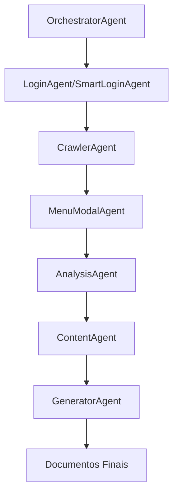

# Guia Técnico - Manual Generator

## 🏗️ Arquitetura Detalhada

### Core Framework (AgnoSCore)

O sistema é baseado no framework AgnoSCore que fornece:

- **BaseAgent**: Classe base para todos os agentes
- **AgentConfig**: Interface de configuração padronizada
- **TaskData/TaskResult**: Estruturas de dados para comunicação entre agentes
- **Pipeline Management**: Gerenciamento de fluxo de execução

### Fluxo de Execução Principal



## 🔧 Configurações Avançadas

### OrchestrationConfig Interface

```typescript
interface OrchestrationConfig {
  maxRetries: number;                    // Máximo de tentativas
  timeoutMinutes: number;               // Timeout global
  enableScreenshots: boolean;           // Captura de screenshots
  outputFormats: ('markdown' | 'html' | 'pdf')[]; // Formatos de saída
  targetUrl: string;                    // URL alvo
  outputDir?: string;                   // Diretório de saída
  crawlingStrategy?: 'basic' | 'advanced'; // Estratégia de crawling
  stopAfterPhase?: 'login' | 'crawling'; // Parar após fase específica
  credentials?: {
    username: string;
    password: string;
    loginUrl?: string;
    customSteps?: Array<{
      type: 'fill' | 'click' | 'wait' | 'waitForSelector';
      selector: string;
      value?: string;
      timeout?: number;
    }>;
  };
}
```

### Configuração de LLM Router

```typescript
// Configuração automática baseada em variáveis de ambiente
const llmConfig = {
  providers: {
    gemini: {
      apiKey: process.env.GOOGLE_API_KEY,
      model: 'gemini-1.5-flash',
      maxTokens: 8192,
      temperature: 0.7
    },
    groq: {
      apiKey: process.env.GROQ_API_KEY,
      model: 'mixtral-8x7b-32768',
      maxTokens: 32768,
      temperature: 0.3
    }
  },
  fallbackOrder: ['gemini', 'groq'],
  circuitBreaker: {
    failureThreshold: 5,
    resetTimeout: 60000
  }
};
```

## 🎯 Estratégias de Crawling

### Estratégia Básica

- Navegação linear por páginas principais
- Extração de conteúdo textual
- Screenshots de páginas principais
- Análise de estrutura HTML básica

### Estratégia Avançada

- Detecção automática de menus e navegação
- Interação com modais e dropdowns
- Exploração de subpáginas
- Análise de componentes dinâmicos
- Mapeamento de fluxos de usuário

### Configuração de Detecção

```typescript
// config/detection-strategies.ts
export const detectionStrategies = {
  menuSelectors: [
    'nav', '.navbar', '.menu', '.navigation',
    '[role="navigation"]', '.header-menu'
  ],
  modalSelectors: [
    '.modal', '.popup', '.dialog', '.overlay',
    '[role="dialog"]', '.lightbox'
  ],
  buttonSelectors: [
    'button', '.btn', '.button', 'input[type="submit"]',
    'input[type="button"]', '[role="button"]'
  ]
};
```

## 🔍 Sistema de Análise

### AnalysisAgent Capabilities

- **Estrutural**: Análise da hierarquia de elementos
- **Semântica**: Compreensão do significado do conteúdo
- **Funcional**: Identificação de funcionalidades
- **Visual**: Análise de layout e design

### ContentAgent Processing

- **Simplificação**: Conversão de conteúdo técnico para linguagem amigável
- **Estruturação**: Organização em seções lógicas
- **Enriquecimento**: Adição de contexto e explicações
- **Validação**: Verificação de qualidade e completude

## 📊 Monitoramento e Métricas

### Timeline Service

```typescript
// Exemplo de uso do Timeline
const timeline = new Timeline();
const sessionId = timeline.startSession('manual-generation');

// Registrar eventos
timeline.recordEvent(sessionId, {
  type: 'agent_start',
  agentName: 'CrawlerAgent',
  timestamp: new Date(),
  metadata: { url: 'https://example.com' }
});

// Analisar performance
const analysis = timeline.analyzeSession(sessionId);
console.log(`Duração total: ${analysis.totalDuration}ms`);
console.log(`Gargalos: ${analysis.bottlenecks}`);
```

### PromptInspector Metrics

- **Response Time**: Tempo de resposta por prompt
- **Success Rate**: Taxa de sucesso por tipo de prompt
- **Quality Score**: Pontuação de qualidade baseada em critérios
- **Token Usage**: Uso de tokens por operação
- **Cost Analysis**: Análise de custos por provider

## 🔐 Segurança e Boas Práticas

### Sanitização de Dados

```typescript
// Exemplo de sanitização
function sanitizeInput(input: string): string {
  return input
    .replace(/<script[^>]*>.*?<\/script>/gi, '') // Remove scripts
    .replace(/javascript:/gi, '')                // Remove javascript: URLs
    .replace(/on\w+\s*=/gi, '')                 // Remove event handlers
    .trim();
}
```

### Isolamento de Contexto

- Cada execução roda em contexto isolado do navegador
- Limpeza automática de dados temporários
- Não persistência de credenciais em logs
- Rotação automática de sessões

### Rate Limiting

```typescript
// Configuração de rate limiting
const rateLimits = {
  requestsPerMinute: 10,
  requestsPerHour: 100,
  burstLimit: 5,
  backoffStrategy: 'exponential'
};
```

## 🚀 Otimizações de Performance

### Caching Strategy

- **Component Analysis Cache**: Cache de análise de componentes
- **Screenshot Cache**: Cache de screenshots por URL
- **LLM Response Cache**: Cache de respostas de IA
- **Artifact Store**: Armazenamento inteligente de artefatos

### Paralelização

```typescript
// Exemplo de processamento paralelo
async function processPages(pages: string[]) {
  const batchSize = 3;
  const batches = chunk(pages, batchSize);
  
  for (const batch of batches) {
    await Promise.all(
      batch.map(page => processSinglePage(page))
    );
  }
}
```

## 🔧 Troubleshooting

### Problemas Comuns

#### 1. Falha de Login
```bash
# Verificar credenciais
echo $GOOGLE_API_KEY

# Testar apenas login
npm run orchestrator:login

# Verificar logs
tail -f agente_multi/output/agent_logs/latest.log
```

#### 2. Timeout de Crawling
```typescript
// Aumentar timeout na configuração
const config = {
  timeoutMinutes: 30, // Aumentar de 15 para 30
  maxRetries: 5
};
```

#### 3. Quota Exceeded
```bash
# Verificar status das chaves
cat agente_multi/gemini-keys-status.json

# Adicionar mais chaves no .env
GEMINI_API_KEY_4=nova_chave_aqui
```

### Logs e Debugging

```typescript
// Habilitar debug detalhado
process.env.DEBUG = 'agente:*';
process.env.LOG_LEVEL = 'debug';

// Logs estruturados com Pino
const logger = pino({
  level: 'debug',
  transport: {
    target: 'pino-pretty',
    options: {
      colorize: true,
      translateTime: 'SYS:standard'
    }
  }
});
```

## 📈 Escalabilidade

### Distribuição de Carga

- **Múltiplas Instâncias**: Execução paralela em containers
- **Queue System**: Sistema de filas para processamento assíncrono
- **Load Balancing**: Distribuição de carga entre providers de IA
- **Horizontal Scaling**: Escalabilidade horizontal com Kubernetes

### Configuração para Produção

```yaml
# docker-compose.yml
version: '3.8'
services:
  manual-generator:
    build: .
    environment:
      - NODE_ENV=production
      - LOG_LEVEL=info
      - GEMINI_MAX_RETRIES=10
    volumes:
      - ./output:/app/output
    deploy:
      replicas: 3
      resources:
        limits:
          memory: 2G
          cpus: '1.0'
```

## 🔄 Integração com CI/CD

### GitHub Actions Example

```yaml
name: Generate Documentation
on:
  schedule:
    - cron: '0 2 * * *'  # Daily at 2 AM
  workflow_dispatch:

jobs:
  generate:
    runs-on: ubuntu-latest
    steps:
      - uses: actions/checkout@v3
      - uses: actions/setup-node@v3
        with:
          node-version: '18'
      - run: npm ci
      - run: npm run orchestrator
        env:
          GOOGLE_API_KEY: ${{ secrets.GOOGLE_API_KEY }}
      - uses: actions/upload-artifact@v3
        with:
          name: generated-manuals
          path: output/
```

---

*Guia Técnico - Manual Generator v2.0*