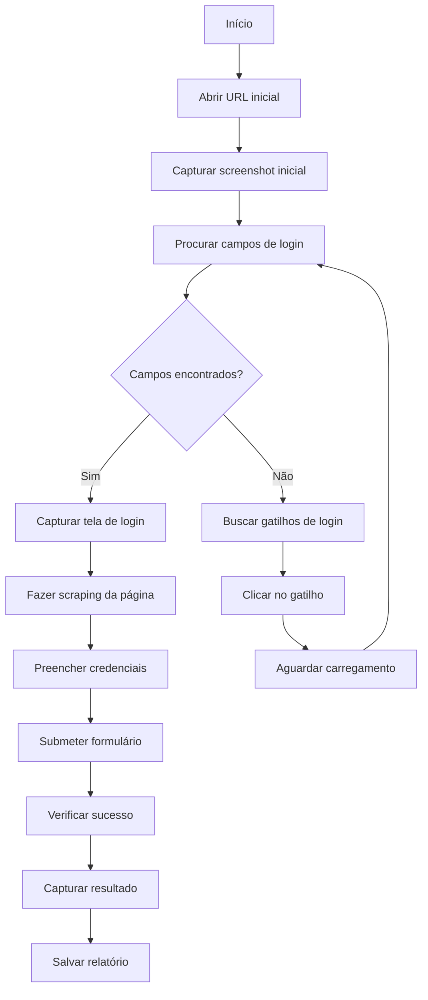

# SmartLoginAgent - Agente Inteligente de Login

## Visão Geral

O **SmartLoginAgent** é um agente inteligente que implementa navegação adaptativa para realizar login automaticamente em sistemas web complexos, incluindo fluxos OAuth/SSO que não possuem campos de login imediatamente visíveis.

## Características Principais

### 🧠 Navegação Adaptativa
- **Detecção Inteligente**: Procura campos de login na página inicial
- **Busca por Gatilhos**: Se não encontrar campos, busca botões/links de login
- **Navegação Automática**: Clica em gatilhos e segue redirecionamentos
- **BFS Limitado**: Usa busca em largura para encontrar a tela de login

### 📸 Captura Completa
- **Screenshots de Cada Etapa**: Captura imagens em cada passo do processo
- **Scraping da Página de Login**: Salva HTML completo e metadados estruturados
- **Relatório Detalhado**: Gera relatório JSON com todas as etapas

### 🔍 Detecção Inteligente
- **Campos de Login**: Detecta campos de usuário e senha automaticamente
- **Botões de Submit**: Encontra botões de envio ou usa fallbacks
- **Verificação de Sucesso**: Confirma login através de múltiplos indicadores

## Fluxo de Funcionamento



## Uso Básico

### Integração no Orchestrator

```typescript
import { SmartLoginAgent } from './agents/SmartLoginAgent';

// No seu orchestrator
if (credentials?.username && credentials?.password) {
  const loginAgent = new SmartLoginAgent();
  await loginAgent.initialize();
  loginAgent.setPage(page);
  
  const loginResult = await loginAgent.processTask({
    type: 'smart_login',
    data: {
      baseUrl: url,
      credentials: credentials
    }
  });
  
  if (!loginResult.success) {
    throw new Error(`Falha no login: ${loginResult.error}`);
  }
}

// Continuar com o crawler...
```

### Uso Standalone

```typescript
const loginAgent = new SmartLoginAgent();
await loginAgent.initialize();
loginAgent.setPage(page);

const result = await loginAgent.processTask({
  type: 'smart_login',
  data: {
    baseUrl: 'https://exemplo.com/login',
    credentials: {
      username: 'usuario',
      password: 'senha'
    }
  }
});
```

## Saídas Geradas

O agente cria um diretório de saída com:

```
logs/login-session-{timestamp}/
├── {timestamp}-initial-page.png          # Screenshot da página inicial
├── {timestamp}-before-click-login.png    # Antes de clicar no gatilho
├── {timestamp}-after-click-login.png     # Após clicar no gatilho
├── {timestamp}-login-page-found.png      # Tela de login encontrada
├── {timestamp}-login-success.png         # Login bem-sucedido
├── login-page.html                       # HTML completo da página de login
├── login-page.json                       # Metadados estruturados
└── login-report.json                     # Relatório completo do processo
```

## Gatilhos de Login Suportados

O agente procura por elementos com os seguintes textos (case-insensitive):

- `login`
- `entrar`
- `acessar`
- `sign in`
- `log in`
- `autenticar`
- `fazer login`
- `conectar`
- `iniciar sessão`
- `access`
- `signin`

## Verificação de Sucesso

O agente considera o login bem-sucedido quando:

1. **Ausência de campos de senha** na página atual, OU
2. **Presença de indicadores de sucesso** E **ausência de indicadores de erro**

### Indicadores de Sucesso
- Elementos com classes: `dashboard`, `profile`, `logout`, `welcome`, `menu`, `user`
- Tags: `nav`, `header`

### Indicadores de Erro
- Elementos com classes: `error`, `invalid`, `wrong`, `alert-danger`, `error-message`

## Configurações

```typescript
export class SmartLoginAgent {
  private maxNavigationAttempts = 5;  // Máximo de tentativas de navegação
  // Timeouts e delays são configuráveis nos métodos
}
```

## Tratamento de Erros

O agente possui tratamento robusto de erros:

- **Timeout de navegação**: Aguarda carregamento da página
- **Elementos não encontrados**: Usa múltiplas estratégias de busca
- **Falha no submit**: Tenta botão, Enter, e JavaScript
- **Logs detalhados**: Registra cada etapa para debug

## Casos de Uso Suportados

### ✅ Login Direto
- Páginas com campos de usuário/senha visíveis
- Formulários tradicionais

### ✅ OAuth/SSO
- Páginas com botão "Fazer Login"
- Redirecionamentos para provedores externos
- Fluxos multi-etapa

### ✅ Sistemas Complexos
- SPAs (Single Page Applications)
- Aplicações React/Angular/Vue
- Sistemas com carregamento dinâmico

## Limitações

- **CAPTCHA**: Não suporta resolução automática de CAPTCHA
- **2FA**: Não suporta autenticação de dois fatores
- **JavaScript Complexo**: Pode ter dificuldades com validações JS muito específicas

## Exemplo Completo

Veja o arquivo `test-integration.ts` para um exemplo completo de integração com o sistema de crawling.

## Logs e Debug

Todos os logs são salvos no diretório de saída e incluem:
- Timestamps precisos
- URLs de cada etapa
- Screenshots de alta qualidade
- Metadados estruturados da página de login
- Relatório final em JSON

Esses dados são valiosos para:
- **Debug de problemas de login**
- **Treinamento de IA** para geração de manuais
- **Documentação automática** de fluxos de autenticação