# Manual de Uso: Google

**URL:** https://www.google.com

## Visão Geral

Documentação completa da página: Google

## Estatísticas

- **Total de elementos:** 22
- **Campos de entrada:** 1
- **Botões:** 2
- **Links:** 11
- **Dropdowns:** 0

## Elementos Principais

### 1. Pesquisar

**Tipo:** input

**Funcionalidade:** Campo de entrada de texto

**Instruções:** Digite o texto desejado no campo "Pesquisar"

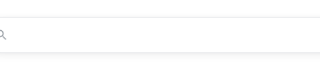

**Detalhes técnicos:**
- Posição: x=716, y=377
- Tamanho: 403x50px
- Seletor: `textarea#APjFqb.gLFyf:nth-of-type(1)`

---

### 2. Pesquisa Google

**Tipo:** button

**Funcionalidade:** Botão de ação

**Instruções:** Clique no botão "Pesquisa Google" para executar a ação

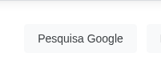

**Detalhes técnicos:**
- Posição: x=816, y=457
- Tamanho: 141x36px
- Seletor: `input.gNO89b:nth-of-type(4)`

---

### 3. Estou com sorte

**Tipo:** button

**Funcionalidade:** Botão de ação

**Instruções:** Clique no botão "Estou com sorte" para executar a ação

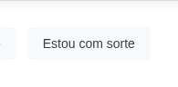

**Detalhes técnicos:**
- Posição: x=969, y=457
- Tamanho: 135x36px
- Seletor: `input.RNmpXc:nth-of-type(5)`

---

## Elementos Secundários

### 1. Gmail

**Tipo:** link

**Funcionalidade:** Link de navegação

**Instruções:** Clique em "Gmail" para navegar

**Detalhes técnicos:**
- Posição: x=1655, y=17
- Tamanho: 34x24px
- Link: https://mail.google.com/mail/&ogbl
- Seletor: `a.gb_X:nth-of-type(1)`

---

### 2. Imagens

**Tipo:** link

**Funcionalidade:** Link de navegação

**Instruções:** Clique em "Imagens" para navegar

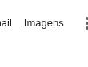

**Detalhes técnicos:**
- Posição: x=1704, y=17
- Tamanho: 50x24px
- Link: https://www.google.com/imghp?hl=pt-BR&ogbl
- Seletor: `a.gb_X:nth-of-type(2)`

---

### 3. Google Apps

**Tipo:** link

**Funcionalidade:** Link de navegação

**Instruções:** Clique em "Google Apps" para navegar

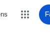

**Detalhes técnicos:**
- Posição: x=1769, y=9
- Tamanho: 40x40px
- Link: https://www.google.com.br/intl/pt-BR/about/products
- Seletor: `a.gb_B:nth-of-type(3)`

---

### 4. Fazer login

**Tipo:** link

**Funcionalidade:** Link de navegação

**Instruções:** Clique em "Fazer login" para navegar

**Detalhes técnicos:**
- Posição: x=1817, y=9
- Tamanho: 93x40px
- Link: https://accounts.google.com/ServiceLogin?hl=pt-BR&passive=true&continue=https://www.google.com/&ec=futura_exp_og_so_72776762_e
- Seletor: `a.gb_A:nth-of-type(4)`

---

### 5. English

**Tipo:** link

**Funcionalidade:** Link de navegação

**Instruções:** Clique em "English" para navegar

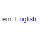

**Detalhes técnicos:**
- Posição: x=1034, y=542
- Tamanho: 43x15px
- Link: https://www.google.com/setprefs?sig=0_f1FRD0IMiSzUxDkFlkIxv1U7WpA%3D&hl=en&source=homepage&sa=X&ved=0ahUKEwjOwPudhvWOAxXYkIkEHYoZIGwQ2ZgBCBU
- Seletor: `a:nth-of-type(5)`

---

### 6. Google Apps

**Tipo:** interactive

**Funcionalidade:** Elemento interativo

**Instruções:** Interaja com "Google Apps"

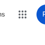

**Detalhes técnicos:**
- Posição: x=1769, y=9
- Tamanho: 40x40px
- Link: https://www.google.com.br/intl/pt-BR/about/products
- Seletor: `a.gb_B:nth-of-type(1)`

---

### 7. Ferramentas de inserção de texto

**Tipo:** interactive

**Funcionalidade:** Elemento interativo

**Instruções:** Interaja com "Ferramentas de inserção de texto"

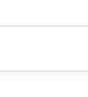

**Detalhes técnicos:**
- Posição: x=1123, y=377
- Tamanho: 40x50px
- Seletor: `div.Umvnrc:nth-of-type(3)`

---

### 8. Pesquisar por voz

**Tipo:** interactive

**Funcionalidade:** Elemento interativo

**Instruções:** Interaja com "Pesquisar por voz"

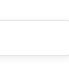

**Detalhes técnicos:**
- Posição: x=1163, y=377
- Tamanho: 40x50px
- Seletor: `div.XDyW0e:nth-of-type(4)`

---

### 9. Pesquisa por imagem

**Tipo:** interactive

**Funcionalidade:** Elemento interativo

**Instruções:** Interaja com "Pesquisa por imagem"

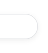

**Detalhes técnicos:**
- Posição: x=1203, y=377
- Tamanho: 40x50px
- Seletor: `div.nDcEnd:nth-of-type(5)`

---

### 10. Pesquisa Google

**Tipo:** interactive

**Funcionalidade:** Elemento interativo

**Instruções:** Interaja com "Pesquisa Google"

**Detalhes técnicos:**
- Posição: x=816, y=457
- Tamanho: 141x36px
- Seletor: `input.gNO89b:nth-of-type(14)`

---

### 11. Não conectar

**Tipo:** interactive

**Funcionalidade:** Elemento interativo

**Instruções:** Interaja com "Não conectar"

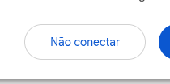

**Detalhes técnicos:**
- Posição: x=1549, y=952
- Tamanho: 150x44px
- Seletor: `div.cvSVBe:nth-of-type(16)`

---

### 12. Fazer login

**Tipo:** interactive

**Funcionalidade:** Elemento interativo

**Instruções:** Interaja com "Fazer login"

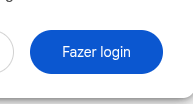

**Detalhes técnicos:**
- Posição: x=1715, y=952
- Tamanho: 133x44px
- Seletor: `div.cvSVBe:nth-of-type(17)`

---

### 13. Configurações

**Tipo:** interactive

**Funcionalidade:** Elemento interativo

**Instruções:** Interaja com "Configurações"

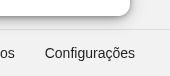

**Detalhes técnicos:**
- Posição: x=1780, y=1034
- Tamanho: 120x46px
- Seletor: `div.CcNe6e:nth-of-type(15)`

---

## Elementos de Navegação

### 1. Sobre

**Tipo:** link

**Funcionalidade:** Link de navegação

**Instruções:** Clique em "Sobre" para navegar

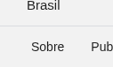

**Detalhes técnicos:**
- Posição: x=20, y=1034
- Tamanho: 67x46px
- Link: https://about.google/?utm_source=google-BR&utm_medium=referral&utm_campaign=hp-footer&fg=1
- Seletor: `a.pHiOh:nth-of-type(6)`

---

### 2. Publicidade

**Tipo:** link

**Funcionalidade:** Link de navegação

**Instruções:** Clique em "Publicidade" para navegar

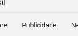

**Detalhes técnicos:**
- Posição: x=87, y=1034
- Tamanho: 102x46px
- Link: https://www.google.com/intl/pt-BR_br/ads/?subid=ww-ww-et-g-awa-a-g_hpafoot1_1!o2&utm_source=google.com&utm_medium=referral&utm_campaign=google_hpafooter&fg=1
- Seletor: `a.pHiOh:nth-of-type(7)`

---

### 3. Negócios

**Tipo:** link

**Funcionalidade:** Link de navegação

**Instruções:** Clique em "Negócios" para navegar

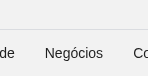

**Detalhes técnicos:**
- Posição: x=190, y=1034
- Tamanho: 88x46px
- Link: https://www.google.com/services/?subid=ww-ww-et-g-awa-a-g_hpbfoot1_1!o2&utm_source=google.com&utm_medium=referral&utm_campaign=google_hpbfooter&fg=1
- Seletor: `a.pHiOh:nth-of-type(8)`

---

### 4. Como funciona a Pesquisa

**Tipo:** link

**Funcionalidade:** Link de navegação

**Instruções:** Clique em "Como funciona a Pesquisa" para navegar

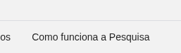

**Detalhes técnicos:**
- Posição: x=278, y=1034
- Tamanho: 197x46px
- Link: https://google.com/search/howsearchworks/?fg=1
- Seletor: `a.pHiOh:nth-of-type(9)`

---

### 5. Privacidade

**Tipo:** link

**Funcionalidade:** Link de navegação

**Instruções:** Clique em "Privacidade" para navegar

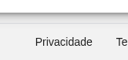

**Detalhes técnicos:**
- Posição: x=1601, y=1034
- Tamanho: 103x46px
- Link: https://policies.google.com/privacy?hl=pt-BR&fg=1
- Seletor: `a.pHiOh:nth-of-type(10)`

---

### 6. Termos

**Tipo:** link

**Funcionalidade:** Link de navegação

**Instruções:** Clique em "Termos" para navegar

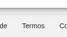

**Detalhes técnicos:**
- Posição: x=1704, y=1034
- Tamanho: 76x46px
- Link: https://policies.google.com/terms?hl=pt-BR&fg=1
- Seletor: `a.pHiOh:nth-of-type(11)`

---

