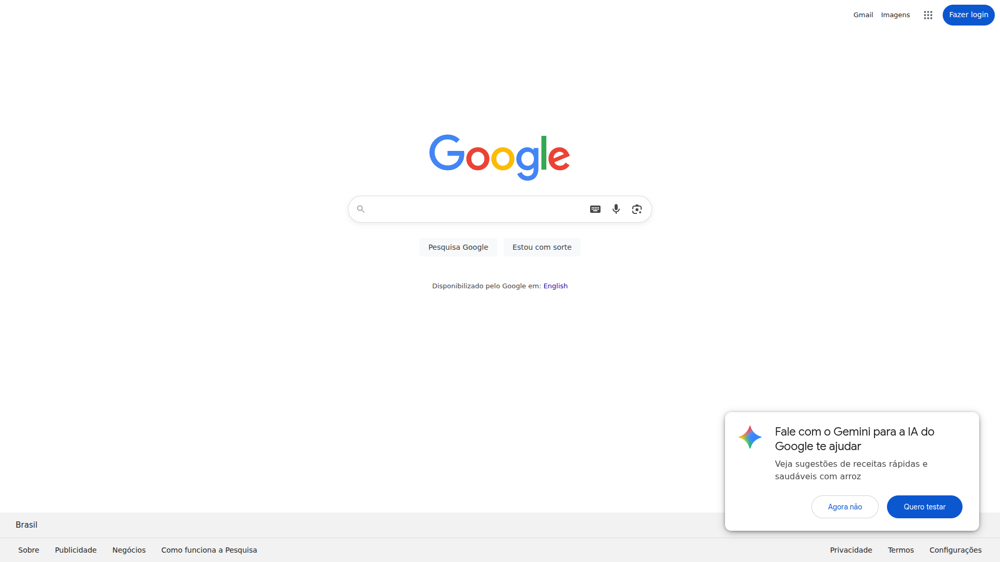

# Manual de Usuário Gerado Automaticamente

**URL Base:** https://www.google.com  
**Data de Geração:** 04/08/2025, 14:11:51  
**Total de Páginas:** 1

---
## Página Principal: https://www.google.com

## Manual do Usuário: Página Principal do Google

**1. Finalidade:**

Esta página é a principal interface de busca do Google.  Sua finalidade é permitir que o usuário realize pesquisas na web utilizando texto, voz ou imagem, acessando também outros serviços do Google.

**2. Elementos Visíveis:**

A página principal do Google apresenta os seguintes elementos:

* **Campo de pesquisa:**  Caixa de texto principal onde o usuário insere sua consulta de pesquisa.
* **Botão "Estou com sorte":**  Redireciona o usuário diretamente para o primeiro resultado da pesquisa, sem exibir a página de resultados.
* **Botão "Pesquisa Google":**  Inicia a pesquisa com base no texto inserido no campo de pesquisa.
* **Ícone de microfone (Pesquisa por voz):** Permite realizar pesquisas por meio de comandos de voz.
* **Ícone de câmera (Pesquisa por imagem):** Permite realizar pesquisas utilizando uma imagem como entrada.
* **Logotipo do Google:**  Link para a página principal do Google.
* **Links para serviços do Google:**  Links rápidos para acesso a outros serviços Google, como Gmail e Google Apps (o conjunto de aplicativos do Google).
* **Ferramentas de inserção de texto:**  Recursos para formatação e inserção de texto no campo de pesquisa (embora não visíveis diretamente, são ativados ao clicar no campo de pesquisa).

**3. Ações Possíveis:**

O usuário pode realizar as seguintes ações na página principal:

* **Realizar pesquisa por texto:** Digitar palavras-chave no campo de pesquisa e clicar em "Pesquisa Google" ou pressionar Enter.
* **Realizar pesquisa por voz:** Clicar no ícone de microfone e falar sua consulta de pesquisa.
* **Realizar pesquisa por imagem:** Clicar no ícone da câmera e selecionar uma imagem do seu computador ou colar um URL de uma imagem.
* **Acessar o Gmail:** Clicar no link do Gmail.
* **Acessar os Google Apps:** Clicar no link dos Google Apps.
* **Utilizar o recurso "Estou com sorte":** Clicar no botão "Estou com sorte" para ir diretamente ao primeiro resultado da pesquisa.

**4. Instruções Passo-a-Passo:**

**4.1 Realizando uma pesquisa por texto:**

1. Localize o campo de pesquisa na página principal.
2. Digite as palavras-chave que descrevem o que você está procurando.
3. Pressione a tecla Enter ou clique no botão "Pesquisa Google".
4. Os resultados da sua pesquisa serão exibidos em uma nova página.

**4.2 Realizando uma pesquisa por voz:**

1. Localize o ícone de microfone na página principal.
2. Clique no ícone.
3. Fale sua consulta de pesquisa claramente.
4. Os resultados da sua pesquisa serão exibidos em uma nova página.

**4.3 Realizando uma pesquisa por imagem:**

1. Localize o ícone da câmera na página principal.
2. Clique no ícone.
3. Selecione a opção para carregar uma imagem do seu computador ou colar um URL de uma imagem.
4. Os resultados da sua pesquisa serão exibidos em uma nova página.

Este manual descreve as funcionalidades básicas da página principal do Google.  Para informações mais detalhadas sobre os serviços do Google, consulte a ajuda específica de cada serviço.
